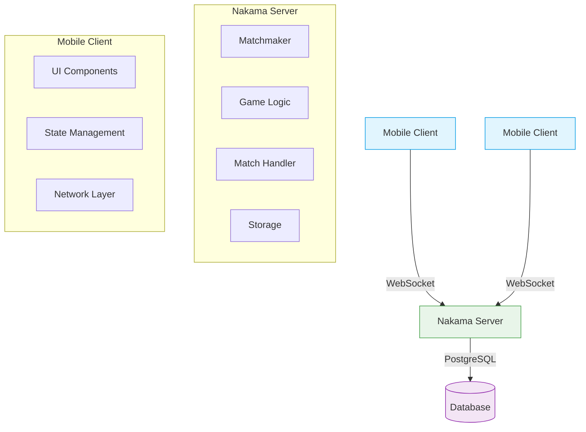
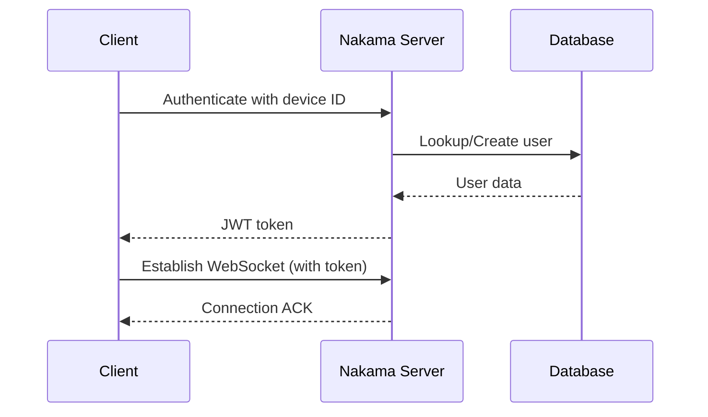
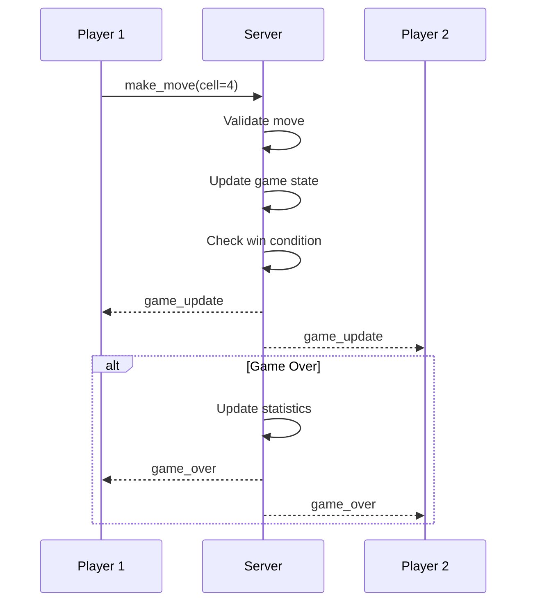
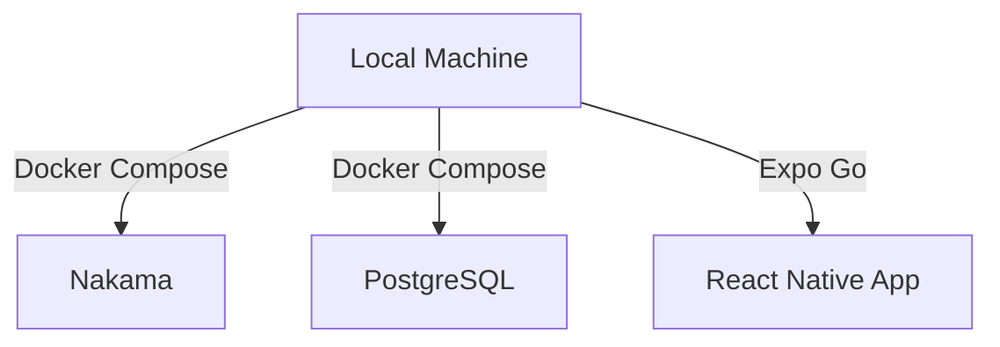
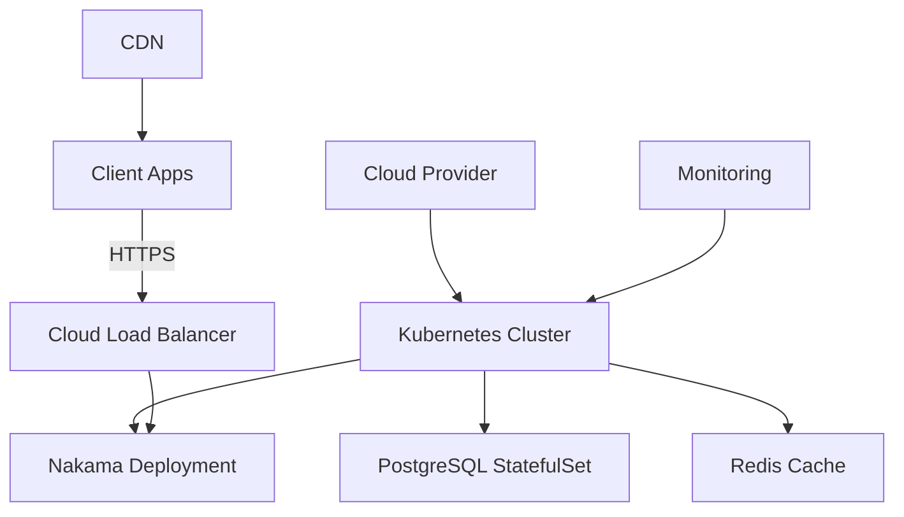

# Tic-Tac-Toe Multiplayer Architecture

## System Overview

## Component Architecture

### 1. Client Layer (React Native + Expo)

**Key Components:**
- **Screens**: Auth, Lobby, Matchmaking, Game, Results
- **Components**: Board, Cell, Leaderboard
- **Services**: API client, WebSocket manager
- **State Management**: React hooks, AsyncStorage

**Responsibilities:**
- User interface rendering
- Input handling
- Local state management
- Network communication
- Session persistence

### 2. Server Layer (Nakama)

**Core Modules:**
- **Matchmaker**: Player pairing, queue management
- **Game Logic**: Move validation, win detection
- **Match Handler**: Match lifecycle management
- **Storage**: Data persistence

**Responsibilities:**
- Authentication & authorization
- Match orchestration
- Game state validation
- Player statistics
- Leaderboard management

### 3. Data Layer

**PostgreSQL Database:**
- `users`: Player accounts and profiles
- `matches`: Game sessions and states
- `leaderboards`: Player rankings
- `statistics`: Player performance metrics

**In-Memory State:**
- Active matches
- Matchmaking queues
- WebSocket connections

## Data Flow

### Authentication

### Gameplay

## Security Model

### Authentication
- Device-based authentication
- JWT session tokens
- Token refresh mechanism

### Authorization
- Match-level access control
- Move validation
- Rate limiting

### Data Protection
- TLS 1.3 for all communications
- Sensitive data encryption
- Input sanitization

## Scalability

### Horizontal Scaling
- Stateless Nakama servers
- Database read replicas
- Connection pooling

### Performance Targets
| Metric | Target |
|--------|--------|
| Matchmaking Time | < 30s |
| Move Processing | < 50ms |
| API Response | < 100ms |
| Concurrent Users | 10,000+ |

## Monitoring & Observability

### Metrics
- Active connections
- Match duration
- Error rates
- Resource usage

### Logging
- Structured logging (JSON)
- Log levels (DEBUG, INFO, WARN, ERROR)
- Centralized log aggregation

### Alerting
- Error rate thresholds
- Performance degradation
- Resource exhaustion

## Deployment Architecture

### Development

### Production

## Disaster Recovery

### Backup Strategy
- **Database**: Hourly snapshots + WAL archiving
- **Configuration**: Git version control
- **Secrets**: Encrypted storage

### Recovery Procedures
1. Restore latest database backup
2. Deploy infrastructure (IaC)
3. Verify system health
4. Resume operations

## Future Enhancements

### Short-term
- [ ] Player avatars
- [ ] In-game chat
- [ ] Push notifications

### Mid-term
- [ ] Tournament system
- [ ] Spectator mode
- [ ] Replay functionality

### Long-term
- [ ] Cross-platform play
- [ ] AI opponents
- [ ] Custom game modes

## Dependencies

### Server
- Nakama 3.17.1+
- PostgreSQL 14+
- Redis (optional)

### Client
- React Native 0.70+
- Expo SDK 48+
- Nakama JS Client 2.7.0+

## Performance Considerations

### Database
- Indexed queries
- Connection pooling
- Read replicas for analytics

### Network
- WebSocket message compression
- Efficient state updates
- Connection keep-alive

### Client
- Optimized re-renders
- Asset optimization
- Lazy loading
